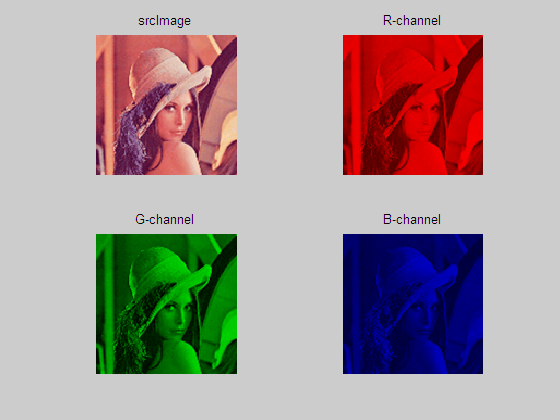
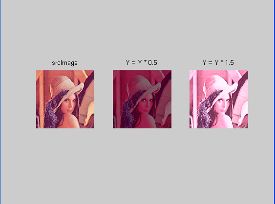
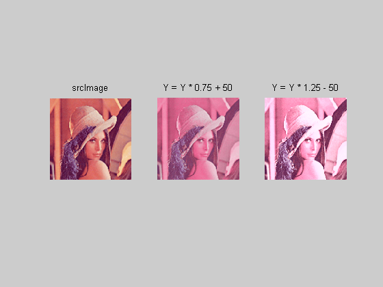

# 实验 1: 数字图像读取及色彩、亮度、对比度变化

## 1.1 实验目的

了解数字图像的存储格式，并学会对图像的某些视觉特征作简单处理。

## 1.2 实验要求

<1> 从最常用的 `.BMP` 图像格式中读取图像数据；
<2> 对数字图像的表示方式（如 RGB、YUV）及各种表示方式之间的转换有初步了解；
<3> 根据输入参数改变数字图像的色彩、亮度、对比度。

## 1.3 实验步骤

<1> 根据 BMP 格式，将图像内容读入内存数组；
<2> 通过访问数字图像 RGB 三个通道的对应矩阵，改变数字图像的色彩；
<3> 将数字图像的 RGB 表示转换为 YUV 表示；

$$
Y=0.30R+0.59G+0.11B \\
U=0.70R-0.59G-0.11B \\
V=-0.30R-0.59G+0.89B
$$

<4> 通过访问 Y（亮度）通道，改变数字图像的亮度；
<5> 通过 Y（亮度）通道作灰度的线性变换，改变数字图像的对比度。

## 1.4 实验图像

实验图像为 `lena.bmp`，如图所示：


## 1.5 实验结果

```matlab
% 调整色彩
R = image_RGB(:, :, 1);
G = image_RGB(:, :, 2);
B = image_RGB(:, :, 3);
image_R = cat(3, R, zeros(rows, cols), zeros(rows, cols));
image_G = cat(3, zeros(rows, cols), G, zeros(rows, cols));
image_B = cat(3, zeros(rows, cols), zeros(rows, cols), B);
figure(1);
subplot(2,2,1); imshow(image_RGB); title(' srcImage ');
subplot(2,2,2); imshow(image_R); title(' R-channel ');
subplot(2,2,3); imshow(image_G); title(' G-channel ');
subplot(2,2,4); imshow(image_B); title(' B-channel ');
```

结果如下：



```matlab
% 调整亮度
[Y, U, V] = RGB2YUV(R, G, B);
image_YUV = cat(3, Y, U, V);

alpha1 = 0.5; Y1 = alpha1 * Y;
[R1, G1, B1] = YUV2RGB(Y1, U, V);
I1 = uint8(cat(3, R1, G1, B1));
alpha2 = 1.5; Y2 = alpha2 * Y;
[R2, G2, B2] = YUV2RGB(Y2, U, V);
I2 = uint8(cat(3, R2, G2, B2));

figure(2);
subplot(1,3,1); imshow(image_RGB); title(' srcImage ');
subplot(1,3,2); imshow(I1); title(' Y = Y * 0.5 ');
subplot(1,3,3); imshow(I2); title(' Y = Y * 1.5 ');
```

结果如下：



```matlab
% 调整对比度
b = 50;
beta1 = 0.75; Y1 = beta1 * Y + b;
[R1, G1, B1] = YUV2RGB(Y1, U, V);
T1 = uint8(cat(3, R1, G1, B1));
beta2 = 1.25; Y2 = beta2 * Y - b;
[R2, G2, B2] = YUV2RGB(Y2, U, V);
T2 = uint8(cat(3, R2, G2, B2));

figure(3);
subplot(1,3,1); imshow(image_RGB); title(' srcImage ');
subplot(1,3,2); imshow(T1); title(' Y = Y * 0.75 + 50 ');
subplot(1,3,3); imshow(I2); title(' Y = Y * 1.25 - 50 ');
```

结果如下：


