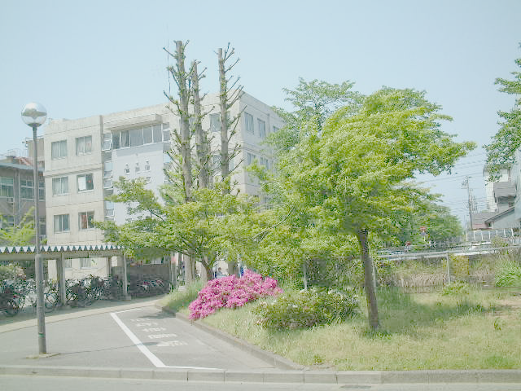
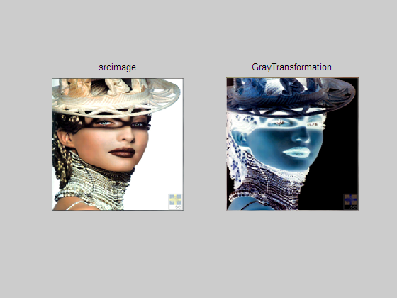
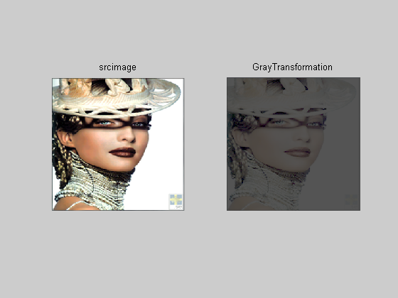
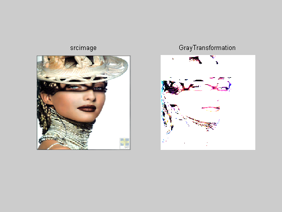
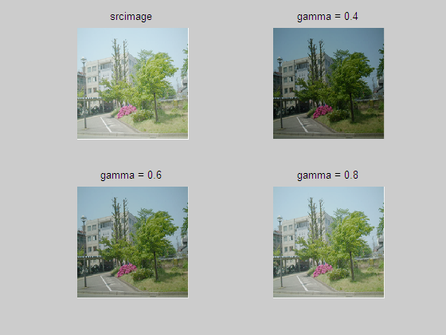

# 实验 2: 数字图像变换与伽马校正

## 2.1 实验目的

了解数字图像的灰度反变换和 $\gamma$(0.4/0.6/0.8) 校正。

## 2.2 实验要求

<1> 对图像进行灰度变换。

<2> 对图像进行 $\gamma$ 校正。

## 2.3 实验步骤

<1> 将 BMP 图像内容读入内存数组。

<2> 调整图像的灰度，对图像进行灰度变换（反变换）。

<3> 对图像进行 $\gamma$ 校正，分别取值为 0.4, 0.6, 0.8。

## 2.4 实验图像

用于灰度变换的图像如下：


用于伽马校正的图像如下：



## 2.5 实验结果

```matlab
% 灰度变换
R=uint8(255-R);
B=uint8(255-B);
G=uint8(255-G);
```

结果如下：



```matlab
% 对数变换
R = uint8(10.5 * log2(1+R));
G = uint8(10.5 * log2(1+G));
B = uint8(10.5 * log2(1+B));
```

结果如下：



```matlab
% 幂率变换
R = uint8(0.5 * (R.^2));
G = uint8(0.5 * (G.^2));
B = uint8(0.5 * (B.^2));
```

结果如下：



```matlab
% 伽马校正
image_name_2 = '../images/GammaCorrection.bmp';
image_2 = double(imread(image_name_2));
C=300;
y1=0.4; T1 = (image_2/C).^(1/y1)*C;
y2=0.6; T2 = (image_2/C).^(1/y2)*C;
y3=0.8; T3 = (image_2/C).^(1/y3)*C;
figure(2);
subplot(2,2,1); imshow(uint8(image_2)); title(' srcimage ');
subplot(2,2,2); imshow(uint8(T1)); title(' gamma = 0.4 ');
subplot(2,2,3); imshow(uint8(T2)); title(' gamma = 0.6 ');
subplot(2,2,4); imshow(uint8(T3)); title(' gamma = 0.8 ');
```

结果如下：


