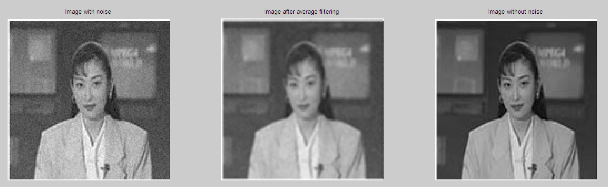
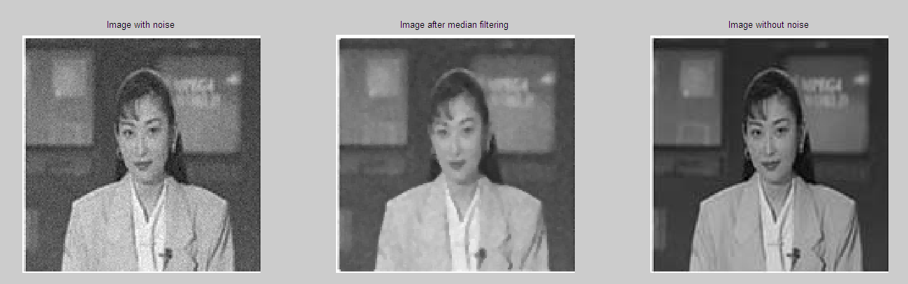

# 实验 3: 学会用滤波器去除图像中的噪声

## 3.1 实验目的

学会用滤波器去除图像中的噪声。

## 3.2 实验要求

<1> 用均值滤波器去除图像中的噪声；
<2> 用中值滤波器去除图像中的噪声；
<3> 比较两种方法的处理结果。

## 3.3 实验步骤

<1> 根据 BMP 格式，将图像内容读入内存数组；
<2> 用均值滤波器去除图像中的噪声；

均值滤波器的原理是：对图像中的每个像素，取其周围的若干个像素的平均值作为该像素的值。均值滤波器的模板是一个矩形，模板的大小是一个奇数，如 3×3、5×5 等。模板的大小越大，平滑效果越好，但是图像的细节也会丢失。

计算公式如下：

$$
f(x_0, y_0) = \frac{1}{4 N^2 + 4 N + 1} \sum_{x=x_0-N}^{x_0+N} \sum_{y=y_0-N}^{y_0+N} f(x, y)
$$

其中，$N$ 是模板的大小。

<3> 用中值滤波器去除图像中的噪声；

中值滤波器的原理是：对图像中的每个像素，取其周围的若干个像素的中值作为该像素的值。中值滤波器的模板是一个矩形，模板的大小是一个奇数，如 3×3、5×5 等。中值滤波器对椒盐噪声有很好的去除效果。

计算公式如下：

$$
f(x_0, y_0) = \text{median} \{ f(x, y) | x_0-N \leq x \leq x_0+N, y_0-N \leq y \leq y_0+N \}
$$

其中，$N$ 是模板的大小。

<4> 将两种处理方法的结果与原图比较；
<5> 注意两种处理方法对边缘的影响。

## 3.4 实验图像

原始图像如下：


加噪声后的图像如下：


## 3.5 实验结果

```matlab
% 均值滤波器去除噪声
T1 = noiseImage;
for i = 1+N : rows-N
    for j = 1+N : cols-N
        kernel = double(noiseImage(i-N:i+N,j-N:j+N));
        T1(i, j) = uint8( (sum(sum(kernel)))/(4*N*N+4*N+1) );
    end
end
figure(1);
subplot(1,3,1); imshow(noiseImage); title(' Image with noise ');
subplot(1,3,2); imshow(T1); title(' Image after average filtering ');
subplot(1,3,3); imshow(srcImage); title(' Image without noise ');
```

均值滤波器去除噪声的结果如下：



```matlab
% 中值滤波器去除噪声
T2 = noiseImage;
for i = 1+N : rows-N
    for j = 1+N : cols-N
        kernel = noiseImage(i-N:i+N,j-N:j+N);
        vec = reshape(kernel, (2*N+1)^2, 1);
        sorted_vec = sort(vec, 1, 'ASCEND');
        mid = median(sorted_vec);
        T2(i, j)=mid;
    end
end
figure(2);
subplot(1,3,1); imshow(noiseImage); title(' Image with noise ');
subplot(1,3,2); imshow(T2); title(' Image after median filtering ');
subplot(1,3,3); imshow(srcImage); title(' Image without noise ');
```

中值滤波器去除噪声的结果如下：


