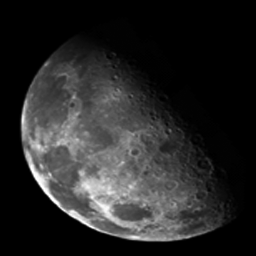
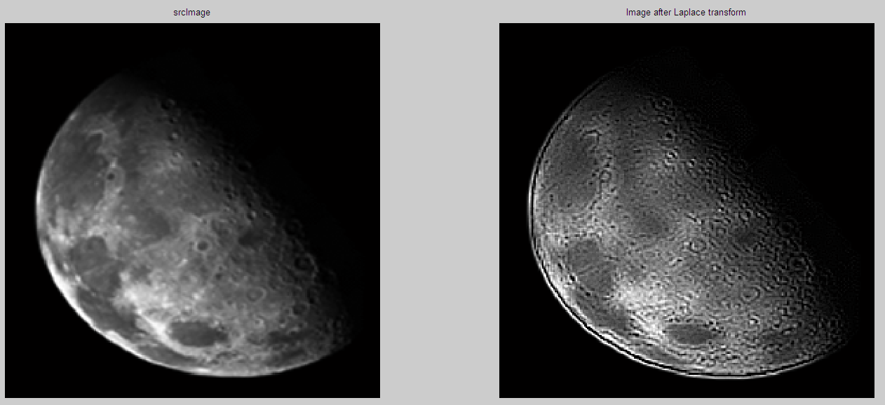
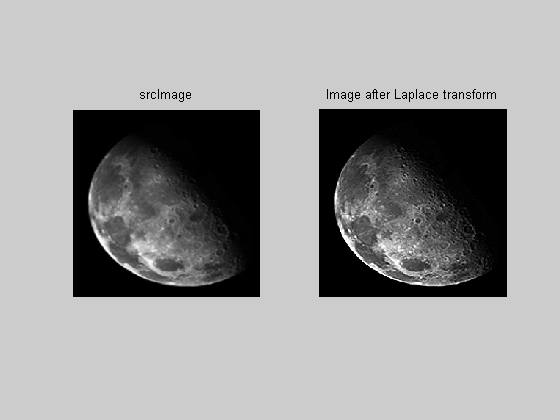

# 实验 4: 图像的空间域锐化（拉普拉斯算子）

## 4.1 实验目的

了解数字图像的空间域锐化和拉普拉斯算子

## 4.2 实验要求

<1> 理解图像的空间域锐化原理

<2> 熟悉拉普拉斯算子的公式和实现

<3> 运用拉普拉斯算子对图像进行空间域锐化

## 4.3 实验步骤

<1> 将 BMP 图像内容读入内存数组

<2> 运用拉普拉斯算子对图像进行空间域锐化

<3> 将锐化后的图像和原图像进行对比

## 4.4 实验图像

原始图像如下：



## 4.5 实验结果

```matlab
LP1= [1 1 1;1 -8 1;1 1 1];
LP2 = [0 1 0;1 -4 1;0 1 0];
LP = LP2

T = image;
for i = 1+N : rows-N
    for j = 1+N : cols-N
        kernel = double(image(i-N:i+N,j-N:j+N));
        T(i,j) = uint8(T(i,j) - sum(sum(LP.*kernel)));
    end
end

figure(1);
subplot(1,2,1); imshow(image); title(' srcImage ');
subplot(1,2,2); imshow(T); title(' Image after Laplace transform ');
```

实验结果如下：




