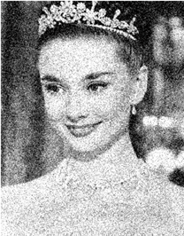
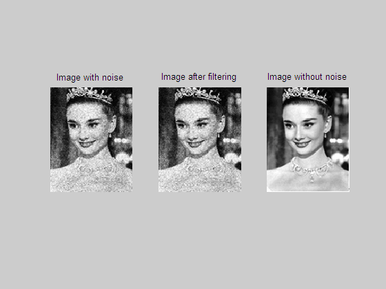
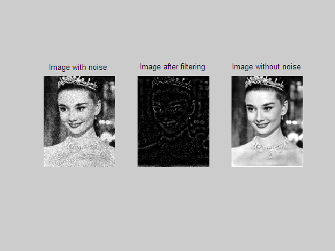
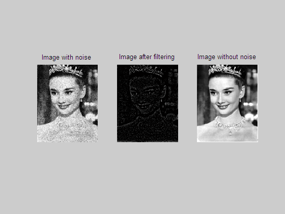

# 实验 5:频率域低通和高通滤波

## 5.1 实验目的

学会两种简单的频域低通和高通滤波方法。

## 5.2 实验要求

<1> 学会傅立叶变换方法；

<2> 使用布特沃斯和高斯滤波器进行低通滤波；

<3> 使用布特沃斯和高斯滤波器进行高通滤波

## 5.3 实验步骤

<1> 将 BMP 图像内容读入内存数组

<2> 用布特沃思低通滤波器进行滤波

$H(u,v) = \frac{1}{1 + (\frac{D(u,v)}{D_0})^{2n}}$

<3> 用高斯低通滤波器进行滤波

$H(u,v) = e^{-D(u,v)^2/2D_0^2}$

<4> 用布特沃思高通滤波器进行滤波

$H(u,v) = \frac{1}{1 + (\frac{D_0}{D(u,v)})^{2n}}$

<5> 用高斯高通滤波器进行滤波

$H(u,v) = 1 - e^{-D(u,v)^2/2D_0^2}$

## 5.4 实验图像

原始图像如下：


加噪声后的图像如下：



## 5.5 实验结果

```matlab
%布特沃思低通滤波器
D0_1 = 80;
H1 = 1./(1+(D./D0_1).^(2*n));
F1 = f.*H1;
T1 = (ifft2(ifftshift(F1)));

figure(1)
subplot(1,3,1); imshow(noiseImage); title(' Image with noise ');
subplot(1,3,2); imshow(uint8(real(T1))); title(' Image after filtering ');
subplot(1,3,3); imshow(srcImage); title(' Image without noise ');
```

布特沃思低通滤波器的实验结果如下：



```matlab
%高斯低通滤波器
D0_2 = 80;
H2 = exp((-(D.^2))/(2*D0_2^2));
F2 = f.*H2;
T2 = uint8(real((ifft2(ifftshift(F2)))));

figure(2)
subplot(1,3,1); imshow(noiseImage); title(' Image with noise ');
subplot(1,3,2); imshow(T2); title(' Image after filtering ');
subplot(1,3,3); imshow(srcImage); title(' Image without noise ');
```

高斯低通滤波器的实验结果如下：


```matlab
%布特沃思高通滤波器
D0_3 = 10;
H3 = 1./(1+(D0_3./D).^(2*n));
F3 = f.*H3;
T3 = uint8(real((ifft2(ifftshift(F3)))));

figure(3)
subplot(1,3,1); imshow(noiseImage); title(' Image with noise ');
subplot(1,3,2); imshow(T3); title(' Image after filtering ');
subplot(1,3,3); imshow(srcImage); title(' Image without noise ');
```

布特沃思高通滤波器的实验结果如下：



```matlab
%高斯高通滤波器
D0_4 = 10;
H4 = 1-exp(-((D.^2)./(2*D0_4.^2)));
F4 = f.*H4;
T4 = uint8(real((ifft2(ifftshift(F4)))));

figure(4)
subplot(1,3,1); imshow(noiseImage); title(' Image with noise ');
subplot(1,3,2); imshow(T4); title(' Image after filtering ');
subplot(1,3,3); imshow(srcImage); title(' Image without noise ');
```

高斯高通滤波器的实验结果如下：


