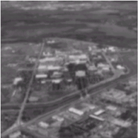
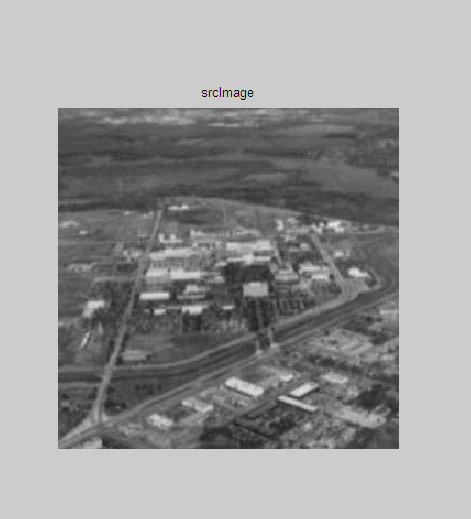
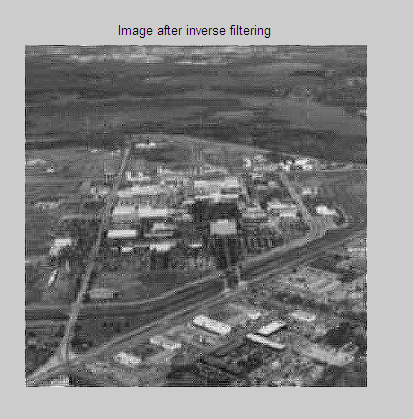
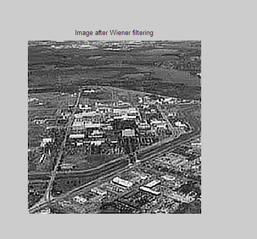

# 实验 6: 数字图像复原

## 6.1 实验目的

了解 Fourier 变换、反变换的算法实现，掌握频域逆滤波和维纳滤波图像复原的方法。

## 6.2 实验要求

<1> 用 Fourier 变换算法对图像作二维 Fourier 变换。

<2> 用 Fourier 反变换算法对图像作二维 Fourier 反变换。

<3> 频域逆滤波和维纳滤波图像复原。

## 6.3 实验步骤

<1> 根据 BMP 格式，将图像内容读入内存数组；

<2> 用快速 Fourier 变换算法，对图像作二维 FFT 变换得到 $G(u,v)$；(考虑图像为 $256 \times 256$，可以采用快速 Fourier 变换方法)

<3> 进行频域逆滤波和维纳滤波

逆滤波退化函数: $\hat{F}(u,v) = \frac{G(u,v)}{H(u,v)}$

维纳滤波退化函数: $\hat{F}(u,v) = \left[ \frac{1}{H(u,v)} \cdot \frac{|H(u,v)|^2}{|H(u,v)|^2 + K} \right] \cdot G(u,v)$

其中 $H(u,v) = \exp(-k(u^2 + v^2)^{5/6})$

<4> 进行 Fourier 反变换得到 $g(x,y)$；

## 6.4 实验图像

原始图像如下：



## 6.5 实验结果

```matlab
% 逆滤波
H = zeros(rows, cols);
for u = 1 : rows
    for v = 1 : cols
        H(u, v) = exp(-k*(u^2+v^2)^(5/6));
    end
end
F1 = G ./ H;
T1 = uint8(real((ifft2(ifftshift(F1)))));

% 维纳滤波
F2 = zeros(rows, cols);
for u = 1 : rows
    for v = 1 : cols
        g = G(u, v);
        h = H(u, v);
        F2(u, v) = (1/h) * (h^2/(h^2+k)) * g;
    end
end
T2 = uint8(real((ifft2(ifftshift(F2)))));

figure(1);
subplot(1,3,1); imshow(image); title(' srcImage ');
subplot(1,3,2); imshow(T1); title(' Image after inverse filtering ');
subplot(1,3,3); imshow(T2); title(' Image after Wiener filtering ');
```

源图像如下：



逆滤波结果如下：



维纳滤波结果如下：


