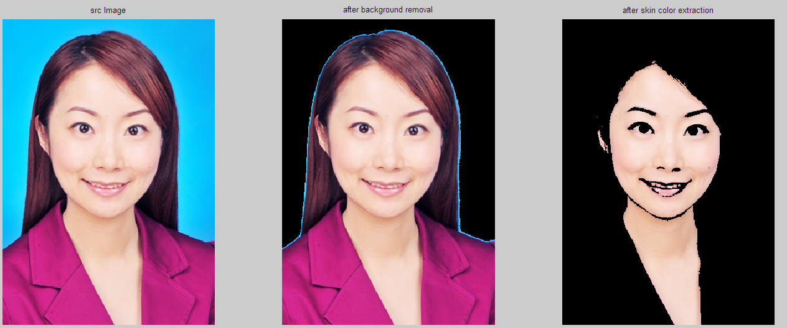

# 实验 7: 人脸皮肤颜色分层

## 7.1 实验目的

使用颜色分层方法，对身份证标准图像实现肤色检测和背景分离。

## 7.2 实验要求

<1> 理解彩色图像的颜色分层原理和方法。

<2> 利用颜色分层方法对彩色图像进行分层处理。

<3> 实现对身份证标准图像的背景分离和皮肤区域提取。

## 7.3 实验步骤

<1> 根据 BMP 格式，将彩色图像内容读入内存数组。

<2> 对图像中背景和皮肤区域计算背景和肤色平均值($a$ 值)，并设置分层阈值 $W$。

<3> 利用图像分层函数对彩色图像进行扫描和计算处理。

<4> 根据背景平均值和分层阈值去掉身份证标准图像背景区域。

<5> 根据肤色平均值和分层阈值提取身份证标准图像皮肤区域。

$$
S_i = \left\{
\begin{aligned}
& 0.5, & \text{if} \left[ \left| R_i - a_j \right| > \frac{W}{2} \right]_{any 1 \leq j \leq n} , i = 1, 2, 3, ..., n\\
& r_i, & \text{otherwise}
\end{aligned}
\right.
$$

## 7.4 实验图像

原始图像如下：


## 7.5 实验结果

```matlab
% 去除背景
bg_mean = mean(bg_color, 1);
bg_std = std(bg_color, 0, 1);
T1 = image;
for u = 1 : rows
    for v = 1 : cols
        im = image(u, v, :);
        is_bg = true;
        for c = 1 : 3
            if(abs(im(c)-bg_mean(c)) > bg_std(c)*3)
                is_bg = false;
            end
        end
        if is_bg %  背景设为黑色
            T1(u, v, :) = [0 0 0];
        end
    end
end

% 提取脸部
skin_color
skin_mean = mean(skin_color, 1)
skin_std = std(skin_color, 0, 1)
T2 = T1;

for u = 1 : rows
    for v = 1 : cols
        im = T1(u, v, :);
        is_skin = true;
        for c = 1 : 3
            if(abs(im(c)-skin_mean(c)) > skin_std(c)*3)
                is_skin = false;
            end
        end
        if ~is_skin % 肤色外设为黑色
            T2(u, v, :) = [0 0 0];
        end
    end
end

figure(1)
subplot(1,3,1); imshow(uint8(image)); title(' src Image ');
subplot(1,3,2); imshow(uint8(T1)); title(' after background removal ');
subplot(1,3,3); imshow(uint8(T2)); title(' after skin color extraction ');
```

实验结果如下：


